# MCTS-LLM

**An example combining Monte Carlo Tree Search (MCTS) and LLMs for self-improvement through critique and refinement.**

This script wraps an LLM with a basic search algorithm designed to iteratively improve an initial answer to a question. At each step, the LLM critiques its previous response and attempts to improve it, with the MCTS algorithm driving exploration and backpropagation of quality signals. The goal is to converge on a better answer than the vanilla model output.

## Overview

This implementation demonstrates:

- Use of **seed answers** to initialise a search tree
- An LLM used in three modes:
  - **Critique**: highlight flaws in a draft
  - **Improve**: rewrite the draft using the critique
  - **Evaluate**: score the final answer numerically
- MCTS with UCT for decision-making over answer revisions
- Logging and structure suitable for extension or adaptation

## Method

The process is as follows:

1. **Seed**: Start with a basic or uncertain answer (`"I'm not sure"` etc.)
2. **Iterate**: For a fixed number of iterations:
   - Select a promising node based on UCT
   - Critique the current answer
   - Generate an improved answer
   - Evaluate the result with a rating prompt
   - Backpropagate the score to update the tree
3. **Select**: Return the highest-value child after search

## Example Usage

```bash
python mcts_llm.py
```

## Paper

<https://arxiv.org/pdf/2406.07394>

## Visual

```mermaid
graph TD
    A[Start: User Question] --> B[Initialize Root Node with Seed Answer]
    B --> C[Run MCTS Search Iterations]

    subgraph Iteration i
        C --> D[Select Node via UCT]
        D --> E{Is Node Fully Expanded?}
        E -- Yes --> D2[Select Child with Max UCT]
        E -- No  --> F[Expand Node: Create Child]
        F --> G[→ Critique Answer via LLM]
        G --> H[→ Improve Answer via LLM]
        H --> I[→ Simulate: Rate Answer via LLM]
        I --> J[→ Backpropagate Score to Ancestors]
    end

    J --> K{All Iterations Complete?}
    K -- No  --> C
    K -- Yes --> L[Return Best Answer]
    L --> M[Display in Console]

    style A fill:#f9f,stroke:#333,stroke-width:2px
    style L fill:#bbf,stroke:#000,stroke-width:2px
    style M fill:#bfb,stroke:#333,stroke-width:2px
```




<details> <summary><strong>Click to expand full CLI output</strong></summary>

```text
────────────────────────────────────── STARTING MCTS-LLM ───────────────────────────────────────
─────────────────────────────────────────── QUESTION ───────────────────────────────────────────
A man and a goat are on one side of a river. They have a boat. How can they go across?
───────────────────────────────────── VANILLA LLM RESPONSE ─────────────────────────────────────
This sounds like a riddle! Here's the solution:

1.  **The man takes the goat across the river.**
2.  **The man returns alone.**
3.  **The man takes the goat across the river.**

Let me know if you'd like to try another one! 😊
───────────────────────────────────────── Iteration 1 ──────────────────────────────────────────
Critique: Okay, let's critique the draft answer.

**Question:** A man and a goat are on one side of a river. They have a boat. How can they go across?

**Critique of Draft Answer: "I'm not sure"**

* **What's wrong:** The answer "I'm not sure" is insufficient. It doesn't demonstrate any attempt to solve the problem.
* **What could be improved:** Explore possible scenarios. Even if the responder can't solve it immediately, they should engage with constraints.
* **Logical Fallacies:** None directly, but lacks reasoning.

**Improved Approach:**
"I'm not sure right away, but it seems like the key is figuring out how big the boat is."

**Option 1:**
"I'm not sure immediately. I need to know how big the boat is..."

**Option 2:**
"Hmm, this sounds like a riddle. The man will probably have to make multiple trips..."

**Option 3:**
"The man could row the goat across, then row back alone..."

**Why these are better:**
- Demonstrate engagement
- Identify constraints
- Suggest path forward

Rating Response: Rating: 75  
Simulated reward: 0.75
───────────────────────────────────────── Iteration 2 ──────────────────────────────────────────
Critique: Here's a critique and breakdown.

**Problem:** Avoids problem instead of solving it. Too short. No reasoning.

**Understanding the Problem:**
1. Classic river-crossing puzzle.
2. Logical Fallacies: Potential cognitive ease and framing bias.

**Improved Approach:**
"Let’s assume the boat only holds one — man or goat. That shapes the solution."

**Improved Answer:**
"1. The man takes the goat across.  
  2. He returns alone.  
  3. He takes the goat again."

**Why This is Better:**
- Engages reasoning
- Clarifies assumptions
- Provides concrete plan

Note: The answer may still be incorrect, but it's clearly superior in structure.

Rating Response: Rating: 85  
Simulated reward: 0.85
───────────────────────────────────────── Iteration 3 ──────────────────────────────────────────
Critique: Let’s critique again.

**Original:** "I'm not sure"

**Problem:** No effort or reasoning. Doesn’t explain or explore alternatives.

**Fallacies:** Appeal to ignorance

**Example Better Answer:**
"The man can row the goat across. That solves the problem."

**Alternative (small boat):**
Same logic applied with constraints.

**Final Improved Answer:**  
The man rows the goat across the river in the boat.

Rating Response: Rating: 100  
Simulated reward: 0.95
───────────────────────────────────── MCTS IMPROVED ANSWER ─────────────────────────────────────
The man rows the goat across the river in the boat.
───────────────────────────────── GROUND TRUTH (Boxed Answer) ──────────────────────────────────
They can use the boat.
────────────────────────────────────── EVALUATION SCORES ───────────────────────────────────────
Vanilla Score Prompt →  
The solution is incomplete. It ignores typical constraints (e.g. leaving the goat unattended).  
Could be valid in trivial cases, but misleading in context.  
**Rating: 40**

MCTS Score Prompt →  
**Rating: 100**
```

</details>
